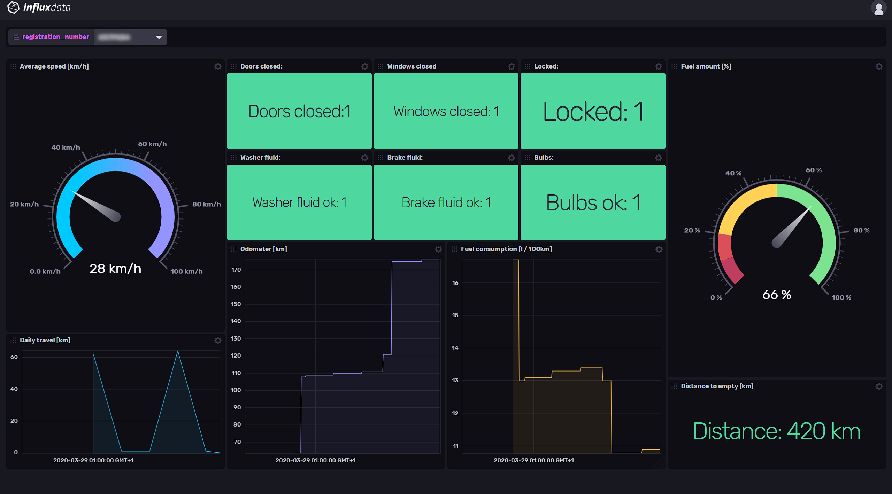

## Volvo on Call Monitoring Template

This InfluxDB Template can be used to retrieve metrics from your Volvo On Call system and show subset of it in a dashboard.



### Included Resources

- 1 Bucket: `volvooncall`, 7d retention
- Labels: `Volvo On Call` + Telegraf Plugin Labels
- 1 Telegraf Configuration
- 1 Dashboard: `Volvo On Call`
- 2 Variables: `bucket` and `registration_number`

## Setup Instructions

  This template uses Python and the [volvooncall](https://github.com/molobrakos/volvooncall) package to interact with the Volvo On Call APIs.

  You will need to own a Volvo car and have the car associated with your Volvo ID.

  You need to copy the provided [volvooncall-retrieve.py](volvooncall-retrieve.py) script to home directory of the user that your `telegraf` is running as - such as `/etc/telegraf` in many cases.

  You will also need to install `volvooncall` Python package as the user that telegraf is running as - such as:

  ```shell
  pip install volvooncall
  ```

  Next, you need to create a file called `.voc.conf` in home directory of the user that `telegraf` is running as, with the following contents:

  ```
  username: (volvo id username)
  password: (volvo id password)
  ```

  Please note that you will need to run said command as same user that the `telegraf` is running as. In most Unix operating systems, you can switch to 


  - `INFLUX_TOKEN` - The token with the permissions to read Telegraf configs and write data to the `volvooncall` bucket. You can just use your master token to get started.
  - `INFLUX_ORG` - The name of your Organization (this will be your email address on the InfluxDB Cloud free tier)
  - `INFLUX_URL` - The URL of your InfluxDB host (this can your localhost, a remote instance, or InfluxDB Cloud)

  You **MUST** set these environment variables before running Telegraf using something similar to the following commands
    
  - This can be found on the `Load Data` > `Tokens` page in your browser: `export INFLUX_TOKEN=TOKEN`
  - Your Organization name can be found on the Settings page in your browser: `export INFLUX_ORG=my_org`

## Customizations

You can run the provided Telegraf configuration on multiple Linux machines, and switch between them using the `windows_host` filter at the top of the dashboard.

## Contact

Provide a way for users to get in touch with you if they have questions or need help using your template. What information you give is up to you, but we encourage providing those below.

- Author: Wojciech Kocjan
- Email: wkocjan@influxdata.com
- Github: [@wojciechka](https://github.com/wojciechka)
- Influx Slack: [@wojciechka](https://influxdata.com/slack)
